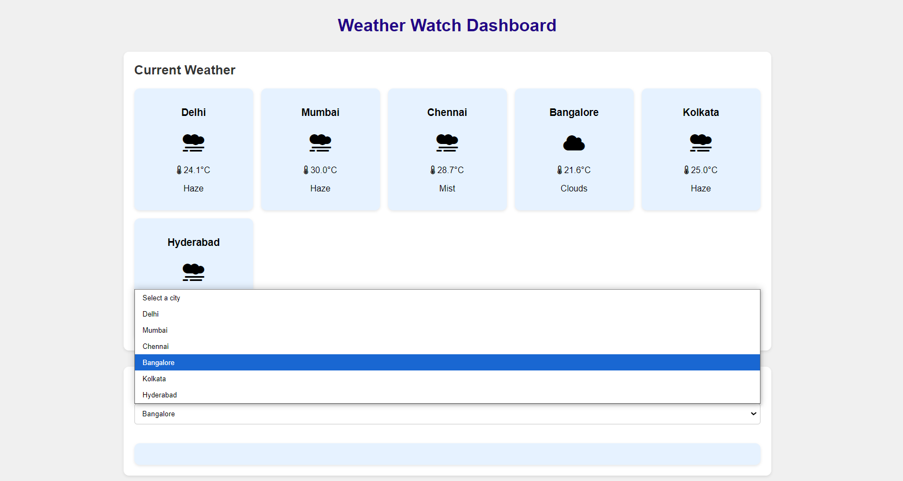
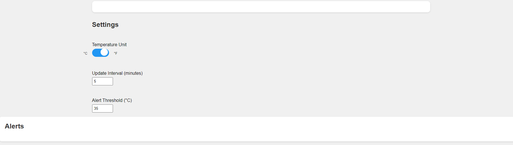
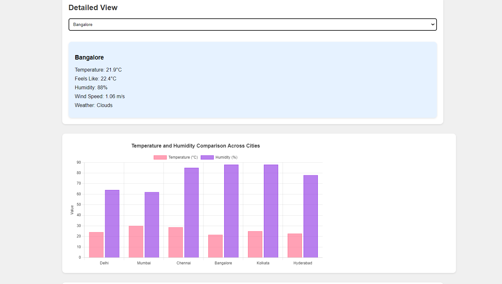

# WeatherMonitoring

Weather Watch Dashboard is a web application that provides real-time weather updates and alerts for multiple cities. It features temperature conversion, weather comparisons, and customizable settings.

## Features

- Real-time weather updates for multiple cities
- Temperature conversion between Celsius and Fahrenheit
- Weather alerts for high temperatures
- Interactive charts for temperature and humidity comparison
- Customizable update intervals and alert thresholds

## Installation

1. Clone the repository:
   ```bash
   git clone https://github.com/yourusername/weatherwatch-dashboard.git
   ```

2. Navigate to the project directory:
   ```bash
   cd weatherwatch-dashboard
   ```

3. Install the required dependencies:
   ```bash
   pip install -r requirements.txt
   ```

4. Set up your API key in `config.py`:
   ```python
   API_KEY = 'your_openweathermap_api_key'
   ```

5. Run the application:
   ```bash
   python app.py
   ```

6. Open your browser and go to `http://localhost:5000`.

# WeatherWatch Dashboard



## Features

- Real-time weather updates for multiple cities
- Temperature conversion between Celsius and Fahrenheit

## Screenshots

### Dashboard Overview


### Detailed View


## Usage

- Use the toggle switch to change the temperature unit between Celsius and Fahrenheit.
- Set the update interval and alert threshold in the settings section.
- View weather alerts and detailed weather summaries for each city.

## Contributing

Contributions are welcome! Please fork the repository and submit a pull request.
